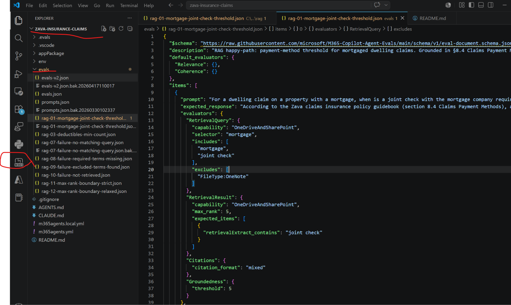

# Bug Bash Retrieval Evaluators on Zava Insurance Claims Agent

---

## 1. Prerequisites

| Tool | Why |
|---|---|
| **VS Code** | Host for the M365 Agents Toolkit extension that provisions the agent. |
| **Microsoft 365 Agents Toolkit** (VS Code extension) | Signs you into M365, builds the agent app package, and uploads it to your tenant. |
| **Node.js 18+** and **npm** | Required to install the `@microsoft/m365-copilot-eval` CLI. |
| **Python 3.10+** | Required by the eval CLI runtime. |
| **Access to the Zava Claims SharePoint site** | The agent's knowledge source - 'https://microsoft.sharepoint-df.com/teams/ZavaClaims/Shared Documents' |

---

## 2. Install and provision the Zava Insurance Claims agent (via the ATK extension)

### 2.1  Get the agent project locally

```powershell
cd zava-insurance-claims
# Either clone the repo, or copy the folder shipped with this bug bash:
# git clone <repo-url-for-zava-insurance-claims> zava-insurance-claims
```

You should end up with a folder containing `appPackage\`, `env\`, `teamsapp.yml`, etc.

### 2.2  Install the Microsoft 365 Agents Toolkit extension in VS Code

1. Open **VS Code**.
2. Go to the **Extensions** view (Ctrl+Shift+X).
3. Search for **"Microsoft 365 Agents Toolkit"** (publisher: *Microsoft*) and click **Install**.
4. After install, the ATK side bar icon appears on the left rail.

### 2.3  Open the agent folder in VS Code

```
File → Open Folder → zava-insurance-claims
```



### 2.4  Sign in and provision

1. Click the **Microsoft 365 Agents Toolkit** icon in the side bar.
2. Under **ACCOUNTS**, sign in to:
   - **Microsoft 365** — the account/tenant that will host the agent.
   - **Azure** — if you plan to deploy any backend resources (not strictly required for this bug bash).
3. Under **LIFECYCLE**, click **Provision**.
4. In the prompt, choose the environment **`local`**.
5. ATK builds the app package (`appPackage\build\appPackage.local.zip`) and uploads it to your tenant. Watch the *Output* panel for progress; provisioning completes in 1–2 minutes.

### 2.5  (Optional) Point the knowledge source at your own SharePoint

The agent's `appPackage\declarativeAgent.json` references:
```
https://microsoft.sharepoint-df.com/teams/ZavaClaims/Shared Documents
```
If your account does not have access, edit the `OneDriveAndSharePoint` capability's `items_by_url[0].url` to point at a SharePoint site **you own** that contains the Zava claims policy guidebook, then re-run **Provision**.

### 2.6  Try the agent in Microsoft 365 Copilot

1. Open **<https://copilot.microsoft.com>** in your browser, signed in with the same M365 account you used in ATK.
2. Click the **agent picker** (top of the chat / right side panel) and choose **Zava Insurance Claims (local)**.
3. Try one of the built-in conversation starters:
   - *"For a dwelling claim on a property with a mortgage, when is a joint check with the mortgage company required?"*
   - *What is a deductible and what standard deductible options are available for Zava HomeShield homeowners policies?*
   - *"What does our claims documentation say about the approval process?"*
   - *"Show me the details for claim CN202504990"*

If the agent responds and (for knowledge prompts) cites the SharePoint doc, you're ready to run evaluations.

---

## 3. Install the eval CLI

The CLI is published on npm: **<https://www.npmjs.com/package/@microsoft/m365-copilot-eval>**. Install it globally so the `runevals` command is on your PATH:

```powershell
npm install -g @microsoft/m365-copilot-eval
```

Verify:
```powershell
runevals --version 
runevals --help
```

> You should see 1.9.* in the version
> If `runevals` is not recognized, ensure your npm global bin folder is on PATH:
> `npm config get prefix` → add `<that path>` (Windows) or `<that path>/bin` (Mac/Linux) to PATH.

---

## 4. A little bit about the new `RetrievalQuery` and `RetrievalResult` evaluators 

PR #360 introduces two **deterministic, non-LLM** evaluators that grade the retrieval artifact your agent emits (the JSON describing the queries it ran and the items it got back). Both produce a binary `pass`/`fail` (score `1.0`/`0.0`) plus a `diagnostic_code`, so failures are precisely classifiable without an LLM judge.

### `RetrievalQuery` — *did the agent search the right thing?*
Inspects every `queryString` issued under a given `capability` (e.g. `OneDriveAndSharePoint`) and grades whether the **queries themselves** look right. You configure a `selector` (case-insensitive substring that picks which queries to judge), plus optional `includes` (terms that must all appear) and `excludes` (terms that must not appear). Failures surface as one of `no_matching_query`, `required_terms_missing`, `excluded_terms_found`, `mixed_term_failure`, or `retrieval_failure`.

### `RetrievalResult` — *did the agent retrieve the right items?*
Grades the **items returned** by a capability against your expectations. You set `capability` plus either `expected_items` (specific docs/URLs, each with optional verbatim extract phrases that must appear in the snippet) and/or `min_expected_count` (minimum number of hits required). `max_rank` (default `10`) bounds how deep into the ranked results the evaluator looks, so it doubles as an ordering/relevance assertion.

---

## 5. Run an evaluation

From inside the **`zava-insurance-claims`** folder run `runevals`:

```powershell
Go to folder zava-insurance-claims

runevals --env local --prompts-file "<path to Zava agent>\zava-insurance-claims\evals\rag-07-failure-no-matching-query.json" --log-level debug --output "<path to Zava agent>\zava-insurance-claims\.evals\2026-05-27_19-25-21-560.html"
```

### What every flag does

| Flag | What it means |
|---|---|
| `runevals` | The CLI entry point installed by `npm install -g @microsoft/m365-copilot-eval`. |
| `--env local` | The ATK environment name. The CLI loads env vars from `env\.env.local` in the current folder (same convention as ATK `provision --env local`). |
| `--prompts-file ".\evals\rag-07-failure-no-matching-query.json"` | Path to a v1.5.0 eval document containing one or more prompts plus their evaluator configurations. Swap the filename to run a different test. |
| `--log-level debug` | Verbose CLI logging — shows the prompt, agent response, retrieval artifact, and the per-evaluator pass/fail reasoning. Useful for bug-bashing. Drop to `info` once stable. |
| `--output ".\.evals\2026-05-27_19-25-21-560.html"` | Where to write the result. **File extension drives the format**: `.html` → styled HTML report (summary banner + aggregates + per-prompt cards), `.json` → raw JSON, `.csv` → flat CSV. Convention is to timestamp the file (`YYYY-MM-DD_HH-mm-ss-fff.html`) so multiple runs don't overwrite. If `--output` is omitted, results print to console only. |

Open the generated `.evals\<timestamp>.html` in your browser to see results.

### Run a different test

Swap the `--prompts-file` and pick a new `--output` filename:

```powershell
$ts = Get-Date -Format 'yyyy-MM-dd_HH-mm-ss-fff'
runevals --env local --prompts-file ".\evals\rag-01-mortgage-joint-check-threshold.json" --log-level debug --output ".\.evals\$ts.html"
```

### Run all 10 datasets in one batch (each produces its own HTML report)

```powershell
Get-ChildItem .\evals\rag-*.json, .\evals\mcp-*.json | ForEach-Object {
    $ts  = Get-Date -Format 'yyyy-MM-dd_HH-mm-ss-fff'
    $out = ".\.evals\$ts-$([IO.Path]::GetFileNameWithoutExtension($_.Name)).html"
    Write-Host "`n=== Running $($_.Name) -> $out ===" -ForegroundColor Cyan
    runevals --env local --prompts-file $_.FullName --log-level debug --output $out
}
```

---

## 8. The prioritized datasets

PR #360 is about retrieval evaluators, so all datasets are RAG focused

### RAG (`evals/rag-*.json`) — 8 tests

| Priority | File | What it covers | Expected outcome |
|---|---|---|---|
| **P1** | `rag-01-mortgage-joint-check-threshold.json` | Happy `RetrievalQuery` + `RetrievalResult` baseline — mortgage joint-check threshold ($10K) from §8.4 | **Pass** |
| **P1** | `rag-07-failure-no-matching-query.json` | Failure code `no_matching_query` | **Fail** (intended) |
| **P1** | `rag-08-failure-required-terms-missing.json` | Failure code `required_terms_missing`; `includes_missing=['unicorn']` | **Fail** (intended) |
| **P1** | `rag-09-failure-excluded-terms-found.json` | Failure code `excluded_terms_found`; `excludes_found=['claim']` | **Fail** (intended) |
| **P1** | `rag-10-failure-not-retrieved.json` | Failure code `not_retrieved` (or `error` if capability had no hits) | **Fail** (intended) |
| **P2** | `rag-03-deductibles-min-count.json` | `min_expected_count` count-only path (§2 Definitions + §6.1 HomeShield) | **Pass** |
| **P2** | `rag-11-max-rank-boundary-strict.json` | `max_rank: 1` boundary — Claims Timeline (§8.3) | **Fail** (likely) |
| **P2** | `rag-12-max-rank-boundary-relaxed.json` | Same prompt as rag-11, `max_rank: 20` — proves `max_rank` is honored | **Pass** |


---

## 9. Filing bugs

File every finding as a **new issue** in the private repo:

🐞 **<https://github.com/microsoft/M365-Copilot-Agent-Evals/issues/new>**

### Required steps
1. Open the link above (you must have read access to the private `microsoft/M365-Copilot-Agent-Evals` repo).
2. Give the issue a **clear, specific title** — e.g. `runevals resolves --prompts-file relative to npm install dir, not cwd`.
3. **Add the `bugbash` label** (Labels gear on the right side of the issue form → search for `bugbash` → select it). This is how the team triages bug-bash findings.
4. (Recommended) Run the commands with `--log-level debug` for rich logs. Please add screenshots and the logs/ error messages in the issue. 

### Include in the issue body
- The **dataset file** used (e.g. `rag-08-failure-required-terms-missing.json`) — attach or paste the JSON.
- The **full evaluator output JSON** from the report (`matched_items`, `missing_items`, `extract_failures`, `matched_queries`, `includes_missing`, `excludes_found`).
- The **CLI version**: output of `npm ls -g @microsoft/m365-copilot-eval`.
- The **exact command** you ran.
- A **screenshot of the HTML report card** (`.evals\<timestamp>.html`) for the failing prompt.
- The **relevant chunk of the `--log-level debug` console output** (redact tokens).
- **Expected vs. actual** behavior in 1–2 sentences.

> ⚠️ Do NOT paste secrets — scrub `AZURE_AI_API_KEY`, bearer tokens, and tenant-specific URLs from logs before posting.

---

## 10. Troubleshooting

| Symptom | Cause / Fix |
|---|---|
| `runevals : The term 'runevals' is not recognized` | npm global bin folder isn't on PATH. Run `npm config get prefix` and add that folder (Windows) or `<that>/bin` (Mac/Linux) to PATH; reopen the terminal. |
| `ERROR Missing required environment variables: …` | `env\.env.local` not found or missing keys. Confirm you ran the command from the `zava-insurance-claims` folder, `env\.env.local` exists there, and all 8 variables from §4 are populated. |
| `Schema validation error: Document validation failed` | The dataset has a field the schema rejects (e.g. `id` at item root, or an unknown evaluator like `ToolCallAccuracy`). Move custom keys under `extensions`; only use evaluators in `EvaluatorMap` (Relevance, Coherence, Groundedness, Similarity, Citations, ExactMatch, PartialMatch, RetrievalQuery, RetrievalResult). |
| HTML report is empty / no aggregates | Agent didn't respond. Re-test the agent in <https://copilot.microsoft.com>; check WorkIQ A2A endpoint reachability and token acquisition; confirm the agent is provisioned in the same tenant as `TENANT_ID`. |
| Agent provision fails in VS Code | Check the *Output* panel → *Microsoft 365 Agents Toolkit* channel. Common causes: not signed into M365, custom-app-upload disabled in tenant (admin must enable it), or SharePoint site is inaccessible. |

---

## 11. Cleanup

```powershell
Remove-Item -Recurse -Force .\.evals
# Optional: uninstall the CLI
npm uninstall -g @microsoft/m365-copilot-eval
```
